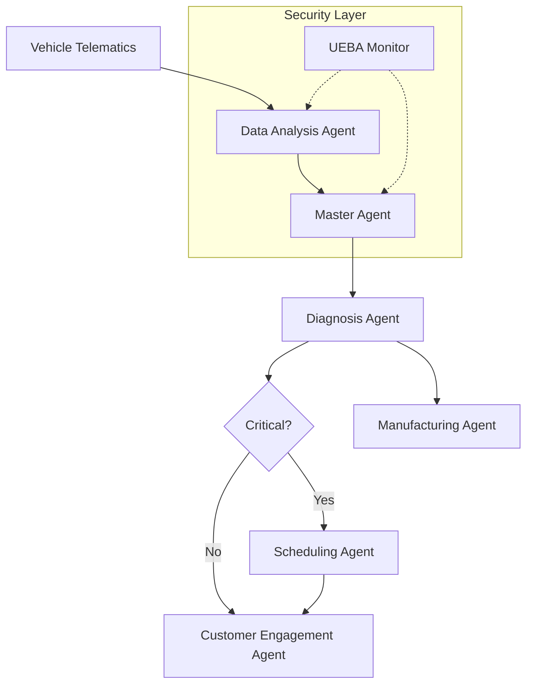

# Autonomous AI Agents for Predictive Vehicle Maintenance


## 🚗 Overview

**Autonomous AI Agents for Predictive Vehicle Maintenance** is an agentic AI system designed to revolutionize the automotive aftermarket. By orchestrating specialized AI agents, the system proactively monitors vehicle health, predicts failures before they occur, autonomously schedules maintenance, and engages customers with personalized communication.

This project demonstrates a **Master-Worker Agent Architecture** where a central orchestrator manages specialized agents for data analysis, diagnosis, scheduling, and manufacturing feedback.

## ✨ Key Features

*   **🤖 Master Agent Orchestration**: A central brain that coordinates workflow between specialized agents.
*   **📡 Real-time Telematics Monitoring**: Ingests and analyzes simulated vehicle sensor data (Engine Temp, Oil Pressure, RPM, etc.).
*   **🔮 Predictive Diagnosis**: Identifies potential failures (e.g., Engine Overheating) with confidence scoring.
*   **📅 Autonomous Scheduling**: Automatically finds and books service appointments based on urgency and service center availability.
*   **💬 Intelligent Customer Engagement**: Generates personalized notifications and updates for vehicle owners.
*   **🛡️ UEBA Security Layer**: User and Entity Behavior Analytics (UEBA) to monitor agent activities and detect anomalies.
*   **🏭 Manufacturing Feedback Loop**: Aggregates defect data to provide actionable insights for future vehicle design improvements.
*   **📊 Real-time Dashboard**: A web-based UI to visualize live telematics streams and agent decision-making processes.

## 🏗️ Architecture

The system is built on a modular architecture:



## 🚀 Getting Started

### Prerequisites

*   Python 3.8 or higher
*   Git

### Installation

1.  **Clone the repository**
    ```bash
    git clone https://github.com/Deepak-Moger/agent-automotive.git
    cd agent-automotive
    ```

2.  **Create and activate a virtual environment** (Optional but recommended)
    ```bash
    python -m venv .venv
    # Windows
    .venv\Scripts\activate
    # Linux/Mac
    source .venv/bin/activate
    ```

3.  **Install dependencies**
    ```bash
    pip install -r requirements.txt
    ```

## 💻 Usage

### 1. Run the Real-time Dashboard
Start the FastAPI backend to see the agents in action via a web interface.

```bash
python -m uvicorn src.ui.api:app --reload
```
*   Open your browser and navigate to: `http://localhost:8000/static/index.html`
*   You will see live simulated telematics data.
*   Click **"Trigger Full Diagnostic Scan"** to watch the agents collaborate.

### 2. Run CLI Simulation
Execute a single end-to-end workflow in the terminal.

```bash
python main.py
```

### 3. Run Tests
Verify the system logic with unit tests.

```bash
python tests/test_agents.py
```

## 📂 Project Structure

```
agent-automotive/
├── docs/                   # Documentation & Presentation assets
├── src/
│   ├── agents/             # Agent implementations
│   │   ├── master_agent.py # Orchestrator
│   │   ├── data_agent.py   # Telematics analysis
│   │   ├── diagnosis_agent.py
│   │   ├── scheduling_agent.py
│   │   └── ...
│   ├── core/               # Core logic (UEBA Security)
│   ├── data/               # Mock data generators
│   └── ui/                 # Dashboard (FastAPI + HTML/JS)
├── tests/                  # Unit tests
├── main.py                 # CLI Entry point
├── requirements.txt        # Python dependencies
└── README.md               # Project documentation
```

## 🛠️ Technologies

*   **Language**: Python
*   **API Framework**: FastAPI
*   **Agent Logic**: Custom BaseAgent implementation (extensible to LangChain/LangGraph)
*   **Frontend**: HTML5, JavaScript (Plotly.js for charts, TailwindCSS for styling)
*   **Simulation**: Custom generators for Telematics and CRM data

## 🔮 Future Roadmap

*   [ ] Integration with real LLMs (OpenAI/Gemini) for dynamic customer conversations.
*   [ ] Connection to live OBD-II / Telematics APIs.
*   [ ] Enhanced Manufacturing Insights Dashboard.
*   [ ] Docker containerization for easy deployment.

## 📄 License

This project is licensed under the MIT License.

---
**Developed by [Deepak Moger](https://github.com/Deepak-Moger)**
