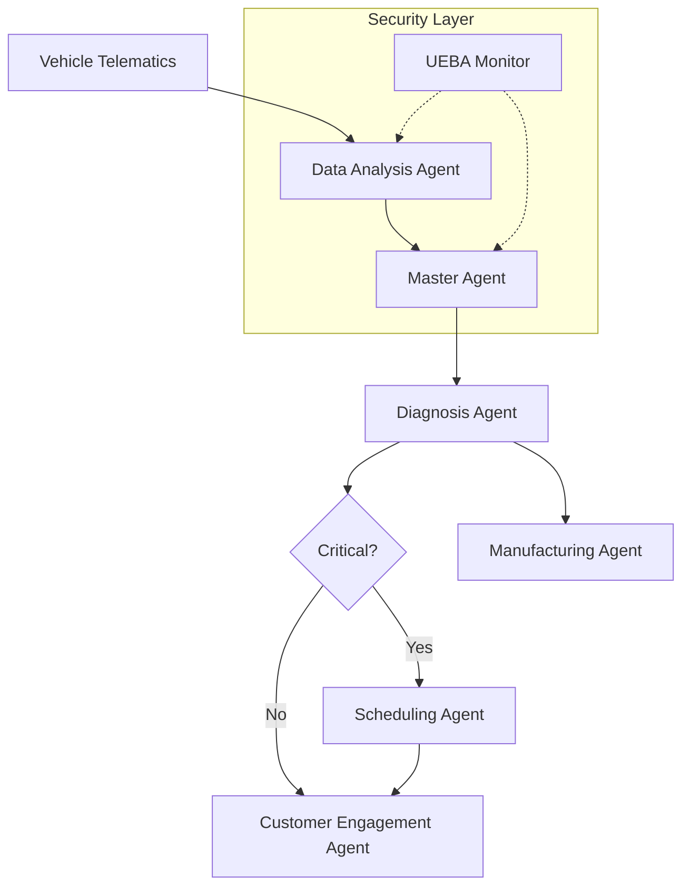
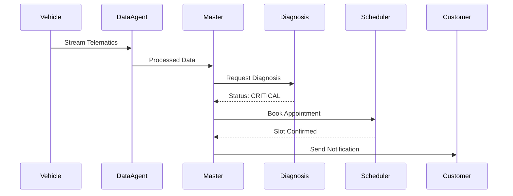

# System Architecture Diagrams

## Agent Orchestration Flow

```mermaid
graph TD
    Start[Vehicle Telematics] --> DataAgent[Data Analysis Agent]
    DataAgent --> Master[Master Agent]
    Master --> Diagnosis[Diagnosis Agent]
    Diagnosis --> Decision{Critical?}
    
    Decision -- Yes --> Scheduling[Scheduling Agent]
    Decision -- No --> Customer[Customer Engagement Agent]
    
    Scheduling --> Customer
    Diagnosis --> Manufacturing[Manufacturing Agent]
    
    subgraph Security Layer
    UEBA[UEBA Monitor] -.-> Master
    UEBA -.-> DataAgent
    end
```

## Data Flow Diagram

```mermaid
sequenceDiagram
    participant Vehicle
    participant DataAgent
    participant Master
    participant Diagnosis
    participant Scheduler
    participant Customer
    
    Vehicle->>DataAgent: Stream Telematics
    DataAgent->>Master: Processed Data
    Master->>Diagnosis: Request Diagnosis
    Diagnosis-->>Master: Status: CRITICAL
    Master->>Scheduler: Book Appointment
    Scheduler-->>Master: Slot Confirmed
    Master->>Customer: Send Notification
```
